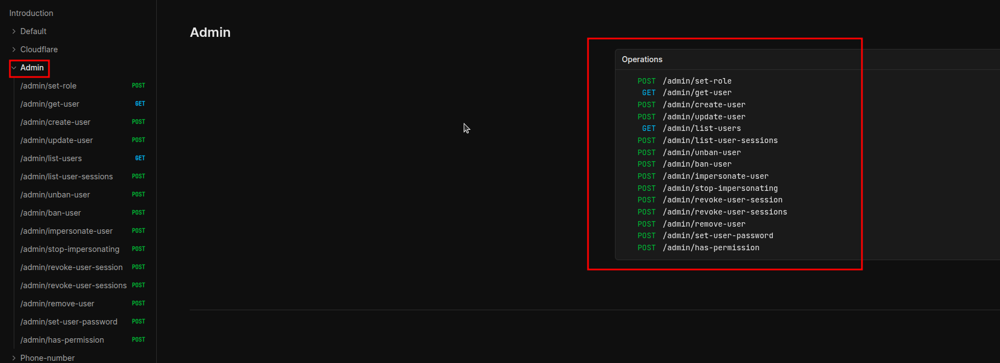
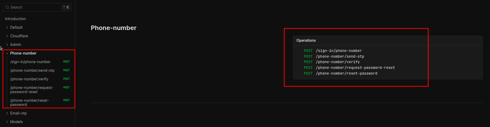
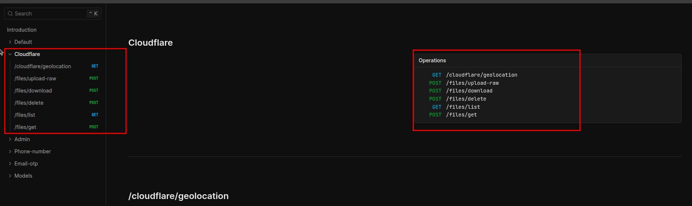
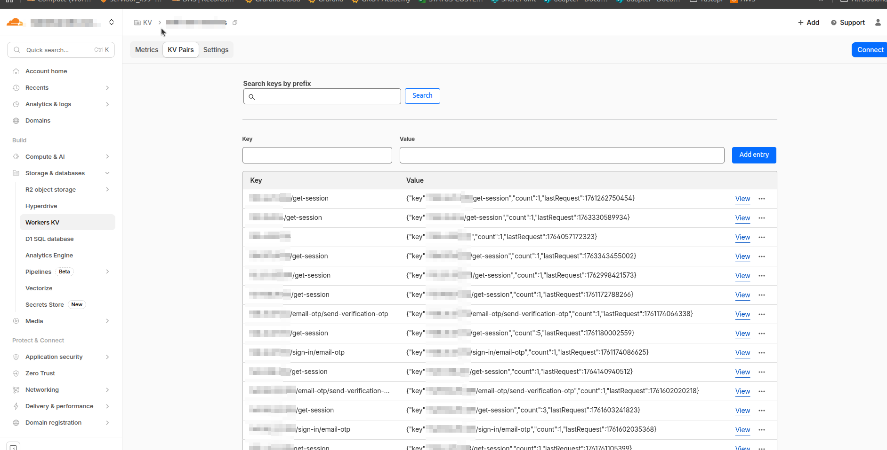
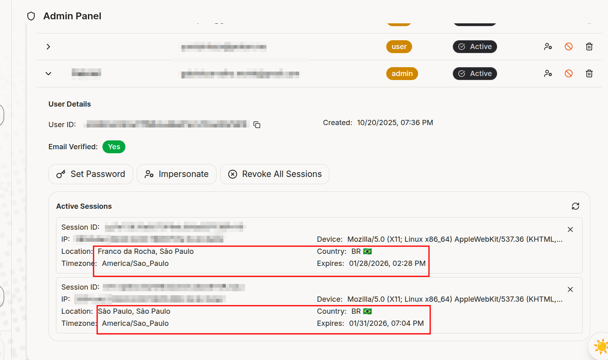

If you're building an API on Cloudflare Workers and need authentication, Better Auth is probably the best choice today. It works like Lego: you declare the plugins you want (email/password, OAuth, 2FA, admin) and it generates all the routes, callbacks and even the database schema.

The combo with Cloudflare is particularly good because:

- **D1** (SQLite at the edge) as the main database
- **KV** as session cache (800ms → 20ms, seriously)
- **R2** for per-user avatar uploads
- **Free geolocation** on every request

> If you want to skip straight to the code, there's a ready-made template: [github.com/gabszs/workers-template](https://github.com/gabszs/workers-template)

## Table of contents

## The problem we're solving

Authentication is one of those problems that seems simple until you start implementing it. You think "oh, it's just a login with email and password", and suddenly you're debugging OAuth flows, writing migrations for refresh tokens, and wondering why the cookie isn't being set in Safari.

Better Auth exists because someone decided this suffering was optional. You configure a JavaScript object with what you want, and it handles the rest: routes, handlers, validations, database schema.

The interesting part is that it works through **plugins**. Want admin? Add `admin()`. Want phone login? Add `phoneNumber()`. Each plugin can add database fields and API routes automatically.

---

## Stack

| Component | Purpose |
|-----------|---------|
| **Hono** | Web framework. Fast, lightweight, runs anywhere |
| **Better Auth** | Auth framework. Modular, type-safe |
| **Drizzle** | ORM. Generates SQL queries without black magic |
| **D1** | Cloudflare's SQLite. Serverless, at the edge |
| **better-auth-cloudflare** | Glues everything together with CF bindings |

---

## Initial setup

First, the dependencies:

```bash
pnpm create hono  # select cloudflare-workers
pnpm add better-auth better-auth-cloudflare
pnpm add drizzle-orm
pnpm add -D drizzle-kit
pnpm add resend  # for emails
```

### Environment variables

Create a `.dev.vars` at the root:

```env
BETTER_AUTH_SECRET=a-long-random-string-here

# OAuth (optional)
GOOGLE_CLIENT_ID=
GOOGLE_CLIENT_SECRET=
GITHUB_CLIENT_ID=
GITHUB_CLIENT_SECRET=

# Email
RESEND_API_KEY=

# CORS
CORS_ORIGIN=http://localhost:3000,http://localhost:3001
```

The `BETTER_AUTH_SECRET` is used to sign tokens and cookies. **Never commit this to the repo.**

### Cloudflare types

Run `pnpm wrangler types` to generate binding types. Your `tsconfig.json` needs to include:

```json
{
  "compilerOptions": {
    "types": ["./worker-configuration.d.ts"]
  }
}
```

### Drizzle config

Drizzle needs to know where the database is. In dev, Wrangler creates a `.sqlite` file inside `.wrangler/`. In prod, it uses D1 via HTTP.

```ts
// drizzle.config.ts
import fs from "node:fs";
import path from "node:path";
import { defineConfig } from "drizzle-kit";

function getLocalD1DB() {
  try {
    const basePath = path.resolve(".wrangler");
    const dbFile = fs
      .readdirSync(basePath, { encoding: "utf-8", recursive: true })
      .find((f) => f.endsWith(".sqlite"));

    if (!dbFile) {
      throw new Error(`.sqlite file not found in ${basePath}`);
    }

    return path.resolve(basePath, dbFile);
  } catch (err) {
    console.log(`Error: ${err}`);
  }
}

export default defineConfig({
  dialect: "sqlite",
  schema: "./src/db/models.ts",
  out: "./src/db/migrations",
  ...(process.env.ALCHEMY_STAGE === "prod"
    ? {
        driver: "d1-http",
        dbCredentials: {
          accountId: process.env.CLOUDFLARE_D1_ACCOUNT_ID,
          databaseId: process.env.CLOUDFLARE_DATABASE_ID,
          token: process.env.CLOUDFLARE_D1_API_TOKEN,
        },
      }
    : {
        dbCredentials: {
          url: getLocalD1DB(),
        },
      }),
});
```

---

## The minimal configuration

If you just want email/password working, the setup is straightforward:

```ts
// src/lib/auth.ts
import { betterAuth } from "better-auth";
import { drizzleAdapter } from "better-auth/adapters/drizzle";
import { drizzle } from "drizzle-orm/d1";
import { models } from "../db/models";

function createAuth(env: CloudflareBindings) {
  const db = drizzle(env.D1, { schema: models });

  return betterAuth({
    database: drizzleAdapter(db, {
      provider: "sqlite",
      usePlural: true,
      schema: models,
    }),
    emailAndPassword: {
      enabled: true,
    },
    trustedOrigins: env.CORS_ORIGIN?.split(",") || ["http://localhost:3000"],
    secret: env.BETTER_AUTH_SECRET,
    basePath: "/api/auth",
  });
}

export function getAuthInstance(env: CloudflareBindings) {
  return createAuth(env);
}

export { createAuth };
```

Done. This already gives you `/api/auth/sign-in`, `/api/auth/sign-up`, `/api/auth/sign-out`, and session validation.

---

## The complete configuration (with the interesting plugins)

This is where things get fun. The `better-auth-cloudflare` package adds native integrations with D1, KV and R2. Combined with the official plugins, you get a pretty robust auth system.

```ts
// src/lib/auth.ts
import { betterAuth } from "better-auth";
import { drizzleAdapter } from "better-auth/adapters/drizzle";
import { admin, emailOTP, openAPI, phoneNumber } from "better-auth/plugins";
import { withCloudflare } from "better-auth-cloudflare";
import { drizzle } from "drizzle-orm/d1";
import { Resend } from "resend";
import { models } from "../db/models";

function createAuth(env: CloudflareBindings, cf?: IncomingRequestCfProperties) {
  const db = drizzle(env.D1, { schema: models });

  return betterAuth({
    ...withCloudflare(
      {
        autoDetectIpAddress: true,
        geolocationTracking: true,
        cf: cf || {},
        d1: {
          db,
          options: {
            usePlural: true,
            debugLogs: true,
          },
        },
        kv: env.KV,
        r2: {
          bucket: env.R2,
          maxFileSize: 2 * 1024 * 1024,
          allowedTypes: [".jpg", ".jpeg", ".png", ".gif"],
        },
      },
      {
        emailAndPassword: {
          enabled: true,
          requireEmailVerification: true,
          sendResetPassword: async ({ user, url }) => {
            const resend = new Resend(env.RESEND_API_KEY);
            await resend.emails.send({
              from: "App <noreply@yourdomain.com>",
              to: user.email,
              subject: "Reset your password",
              html: `<p>Click <a href="${url}">here</a> to reset your password.</p>`,
            });
          },
        },
        emailVerification: {
          sendVerificationEmail: async ({ user, url }) => {
            const resend = new Resend(env.RESEND_API_KEY);
            await resend.emails.send({
              from: "App <noreply@yourdomain.com>",
              to: user.email,
              subject: "Verify your email",
              html: `<p>Click <a href="${url}">here</a> to verify your email.</p>`,
            });
          },
          sendOnSignUp: true,
          autoSignInAfterVerification: true,
        },
        plugins: [
          openAPI(),
          admin(),
          phoneNumber(),
          emailOTP({
            async sendVerificationOTP({ email, otp, type }) {
              if (type === "sign-in") {
                const resend = new Resend(env.RESEND_API_KEY);
                await resend.emails.send({
                  from: "App <noreply@yourdomain.com>",
                  to: email,
                  subject: "Your verification code",
                  html: `<p>Your code: <strong>${otp}</strong></p>`,
                });
              }
            },
          }),
        ],
        socialProviders: {
          google: {
            clientId: env.GOOGLE_CLIENT_ID || "",
            clientSecret: env.GOOGLE_CLIENT_SECRET || "",
          },
          github: {
            clientId: env.GITHUB_CLIENT_ID || "",
            clientSecret: env.GITHUB_CLIENT_SECRET || "",
          },
        },
      }
    ),
    database: drizzleAdapter(db, {
      provider: "sqlite",
      usePlural: true,
      schema: models,
    }),
    trustedOrigins: env.CORS_ORIGIN?.split(",") || ["http://localhost:3000"],
    secret: env.BETTER_AUTH_SECRET,
    basePath: "/api/auth",
    telemetry: { enabled: false },
  });
}

export function getAuthInstance(env: CloudflareBindings) {
  return createAuth(env);
}

export { createAuth };
```

---

## Plugins worth using

### openAPI()

Generates OpenAPI documentation for all auth routes. Access `/api/auth/reference` and you get an interactive UI to test everything.

There's a live example here: [template-hono-workers-api.gabszs.workers.dev/api/auth/reference](https://template-hono-workers-api.gabszs.workers.dev/api/auth/reference)

### admin()

Adds user management: listing, banning, session impersonation, role management.
**Added fields:**

- `users.role`
- `users.banned`
- `users.banReason`
- `users.banExpires`
- `sessions.impersonatedBy`

*Admin plugin endpoints: listUsers, banUser, unbanUser, setRole, impersonateUser and stopImpersonating*

### phoneNumber()

Adds `users.phoneNumber` and `users.phoneNumberVerified` at users table. Enables login via SMS/WhatsApp.

*Endpoints for sending and verifying codes via SMS/WhatsApp*

### emailOTP()

Alternative to magic link. User receives a 6-digit code by email instead of a link.

*Endpoints for sending and verifying 6-digit codes via email*

### withCloudflare() - this is the important one

The [better-auth-cloudflare](https://github.com/zpg6/better-auth-cloudflare) package is what makes the Cloudflare integration worthwhile.

*Endpoints for KV, R2 and automatic geolocation integration*

**KV as session cache:**

This is the most impactful feature. Verifying sessions on D1 during cold start takes ~800ms-1s. With KV, it drops to ~12-20ms. The difference is massive in applications with lots of authenticated requests.

*Cloudflare KV dashboard showing cached user sessions*


*Response time comparison: ~12-20ms with KV cache vs ~800ms-1s without cache*

**R2 for uploads:**

Creates automatic routes for per-user file uploads. You configure max file size and allowed types, and each file gets associated with the logged-in user.

**Geolocation on sessions:**

Automatically adds:

- `timezone`
- `city`
- `country`
- `region`
- `regionCode`
- `colo`
- `latitude`
- `longitude`

*Session data with automatic geolocation: timezone, city, country, region and coordinates*

You can see where your users are logging in from without doing anything.

---

## OAuth: Google and GitHub

Configuring OAuth is just passing the credentials:

```ts
socialProviders: {
  google: {
    clientId: env.GOOGLE_CLIENT_ID || "",
    clientSecret: env.GOOGLE_CLIENT_SECRET || "",
  },
  github: {
    clientId: env.GITHUB_CLIENT_ID || "",
    clientSecret: env.GITHUB_CLIENT_SECRET || "",
  },
},
```

To get the credentials:

1. **Google:** [console.cloud.google.com](https://console.cloud.google.com/) → APIs & Services → Credentials → OAuth 2.0 Client ID
   - Redirect URI: `https://your-domain.com/api/auth/callback/google`

2. **GitHub:** [github.com/settings/developers](https://github.com/settings/developers) → OAuth Apps → New
   - Callback URL: `https://your-domain.com/api/auth/callback/github`

Better Auth generates the routes automatically:

- `/api/auth/sign-in/google`
- `/api/auth/sign-in/github`
- `/api/auth/callback/google`
- `/api/auth/callback/github`

---

## The generated schema

The Better Auth CLI generates the Drizzle schema automatically. After running `pnpm auth:generate`, you'll have something like this:

```ts
// src/db/authModels.ts
import { integer, sqliteTable, text } from "drizzle-orm/sqlite-core";

export const users = sqliteTable("users", {
  id: text("id").primaryKey(),
  name: text("name").notNull(),
  email: text("email").notNull().unique(),
  emailVerified: integer("email_verified", { mode: "boolean" }).default(false).notNull(),
  image: text("image"),
  createdAt: integer("created_at", { mode: "timestamp_ms" }).notNull(),
  updatedAt: integer("updated_at", { mode: "timestamp_ms" }).notNull(),
  // admin()
  role: text("role"),
  banned: integer("banned", { mode: "boolean" }).default(false),
  banReason: text("ban_reason"),
  banExpires: integer("ban_expires", { mode: "timestamp_ms" }),
  // phoneNumber()
  phoneNumber: text("phone_number").unique(),
  phoneNumberVerified: integer("phone_number_verified", { mode: "boolean" }),
});

export const sessions = sqliteTable("sessions", {
  id: text("id").primaryKey(),
  expiresAt: integer("expires_at", { mode: "timestamp_ms" }).notNull(),
  token: text("token").notNull().unique(),
  ipAddress: text("ip_address"),
  userAgent: text("user_agent"),
  userId: text("user_id").notNull().references(() => users.id, { onDelete: "cascade" }),
  // withCloudflare geolocation
  timezone: text("timezone"),
  city: text("city"),
  country: text("country"),
  region: text("region"),
  regionCode: text("region_code"),
  colo: text("colo"),
  latitude: text("latitude"),
  longitude: text("longitude"),
  // admin()
  impersonatedBy: text("impersonated_by"),
});
```

---

## Setting up the Hono handler

```ts
// src/index.ts
import { Hono } from "hono";
import { cors } from "hono/cors";
import { createAuth, getAuthInstance } from "./lib/auth";

type AppBindings = {
  Bindings: CloudflareBindings;
  Variables: {
    userId: string;
    auth: ReturnType<typeof createAuth>;
  };
};

const app = new Hono<AppBindings>();

app.use(
  "/*",
  cors({
    origin: (origin, c) => c.env.CORS_ORIGIN?.split(",") || ["http://localhost:3000"],
    credentials: true,
  })
);

app.use("*", async (c, next) => {
  if (c.req.path.startsWith("/api/auth")) {
    const auth = createAuth(c.env, (c.req.raw as any).cf || {});
    c.set("auth", auth);
  }
  await next();
});

app.all("/api/auth/*", async (c) => {
  const auth = c.get("auth");
  return auth.handler(c.req.raw);
});

export default app;
```

---

## Protecting routes

```ts
// src/lib/middleware.ts
import { createMiddleware } from "hono/factory";
import { getAuthInstance } from "./auth";

export const authMiddleware = createMiddleware(async (c, next) => {
  const auth = getAuthInstance(c.env);
  const session = await auth.api.getSession({ headers: c.req.raw.headers });

  if (!session?.user) {
    return c.text("Unauthorized", 401);
  }

  c.set("userId", session.user.id);
  await next();
});
```

Usage:

```ts
import { Hono } from "hono";
import { authMiddleware } from "./lib/middleware";

const app = new Hono();

// Public routes
app.get("/health", (c) => c.json({ status: "ok" }));

// Protected routes
app.use("/api/*", authMiddleware);

app.get("/api/me", (c) => {
  const userId = c.get("userId");
  return c.json({ userId });
});
```

---

## Generating the frontend with AI

The `openAPI()` plugin generates a complete specification at `/api/auth/openapi.json`. You can feed this to an AI and ask it to generate frontend hooks:

```
Generate authentication hooks for React based on this OpenAPI spec:

[paste the JSON here]

Requirements:
- Native fetch with credentials: 'include'
- TypeScript
- Hooks for: sign-in, sign-up, sign-out, get-session
- Error handling
```

It works surprisingly well.

---

## Useful scripts

```json
{
  "scripts": {
    "dev": "wrangler types && wrangler dev",
    "deploy": "wrangler types && wrangler deploy",
    "cf-typegen": "wrangler types",
    "auth:generate": "ALCHEMY_STAGE=dev npx @better-auth/cli@latest generate --config src/lib/auth.ts --output src/db/authModels.ts -y",
    "db:generate": "drizzle-kit generate",
    "db:migrate:dev": "wrangler d1 migrations apply your-db --local",
    "db:migrate:prod": "wrangler d1 migrations apply your-db --remote",
    "studio": "drizzle-kit studio"
  }
}
```

---

## Development workflow

### Initial setup

```bash
pnpm cf-typegen      # generates Cloudflare types
pnpm auth:generate   # generates Better Auth schema
pnpm db:generate     # generates migrations
pnpm db:migrate:dev  # applies migrations locally
pnpm dev             # runs the server
```

### Adding a plugin

```bash
# 1. Add the plugin in src/lib/auth.ts

# 2. Regenerate the schema
pnpm auth:generate

# 3. Generate new migration
pnpm db:generate

# 4. Apply locally
pnpm db:migrate:dev

# 5. In prod
pnpm db:migrate:prod
```

> The `auth:generate` command needs to run every time you modify plugins. It reads your config and generates the corresponding models.

---

## Deploy

```bash
pnpm db:migrate:prod  # migrations first
pnpm deploy           # then the worker
```

---

## Why this stack?

- **Minimal latency**: everything runs at the edge, close to the user
- **Zero cost to start**: D1 has a generous free tier
- **End-to-end type safety**: from the database to the frontend
- **Modular**: you only add what you need
- **KV as cache**: reduces session verification from 1s to 20ms
- **Free geo**: Cloudflare already gives you this on every request

---

## Links

- [Complete template](https://github.com/gabszs/workers-template)
- [Better Auth docs](https://www.better-auth.com/)
- [better-auth-cloudflare](https://github.com/zpg6/better-auth-cloudflare)
- [Drizzle ORM](https://orm.drizzle.team/)
- [Cloudflare D1](https://developers.cloudflare.com/d1/)

---

If you liked this post, have any feedback or questions, you can reach me on [WhatsApp](https://wa.me/5511947047830) or [email](mailto:gabrielcarvalho.workk@gmail.com).

By [Gabriel Carvalho](https://www.linkedin.com/in/gabzsz/)
